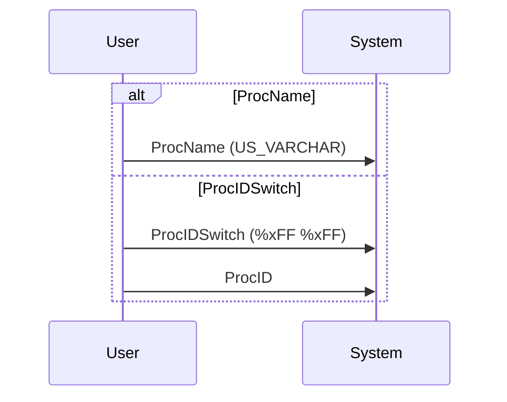
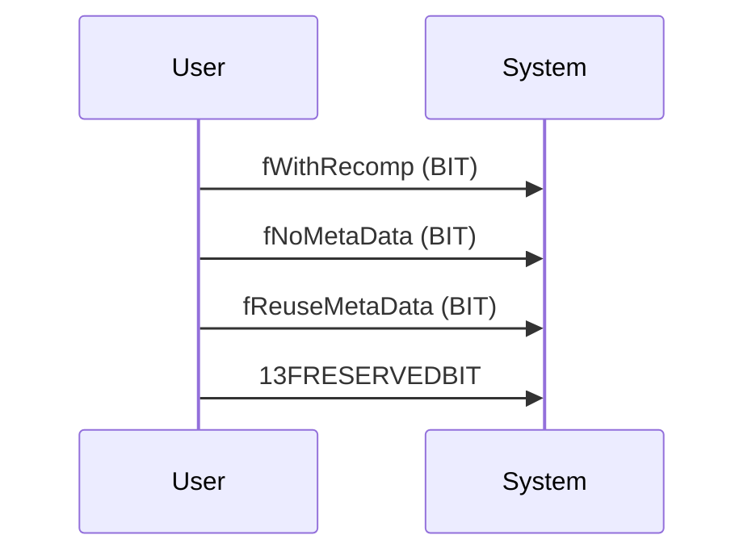
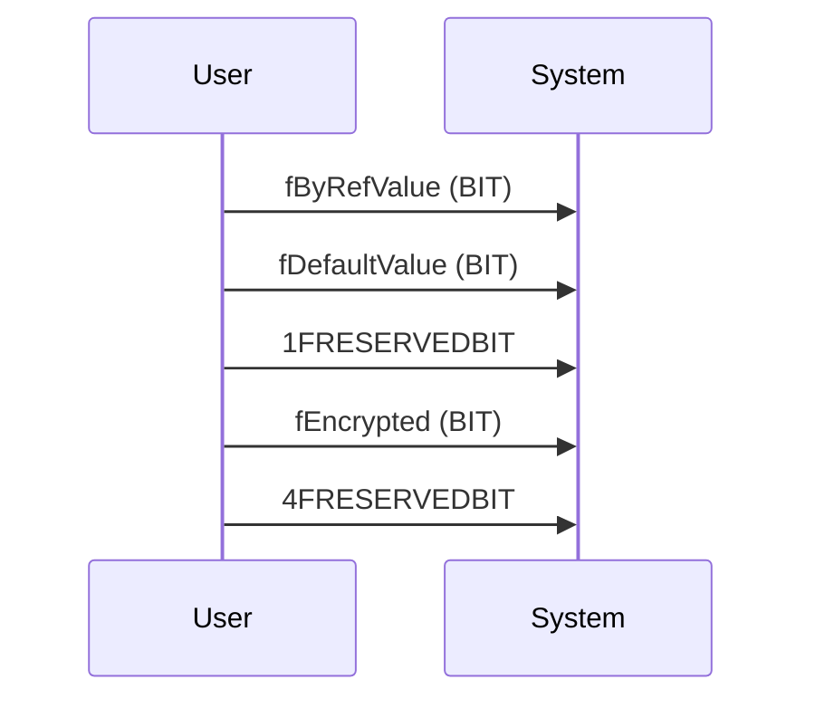
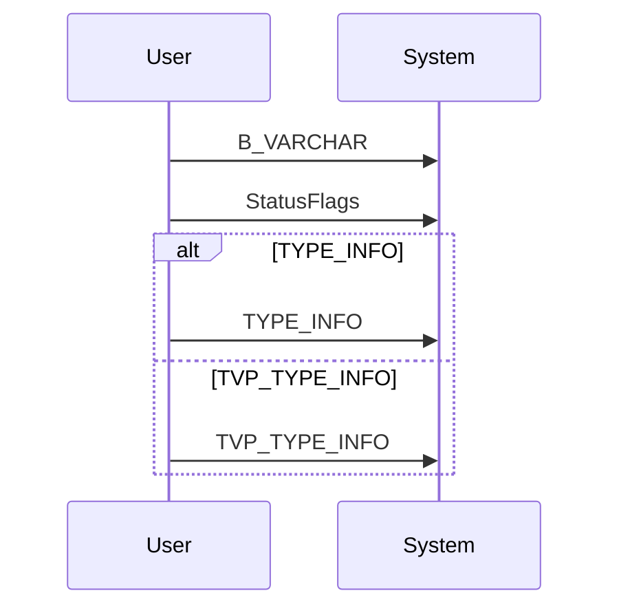
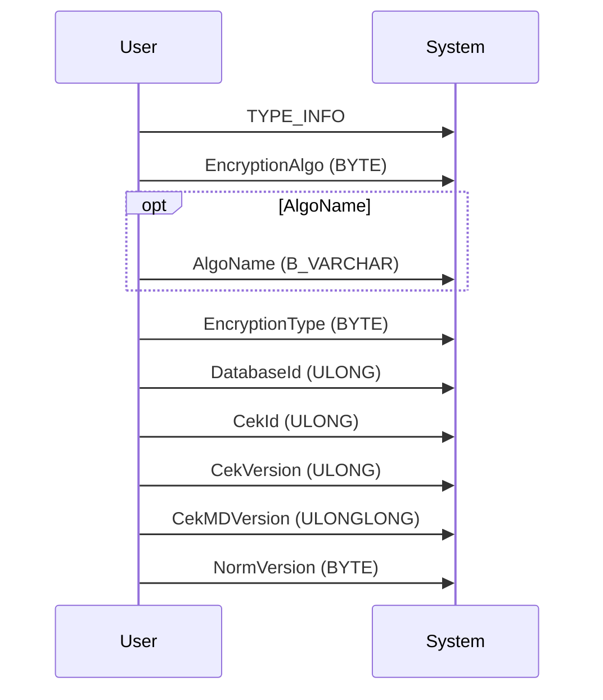
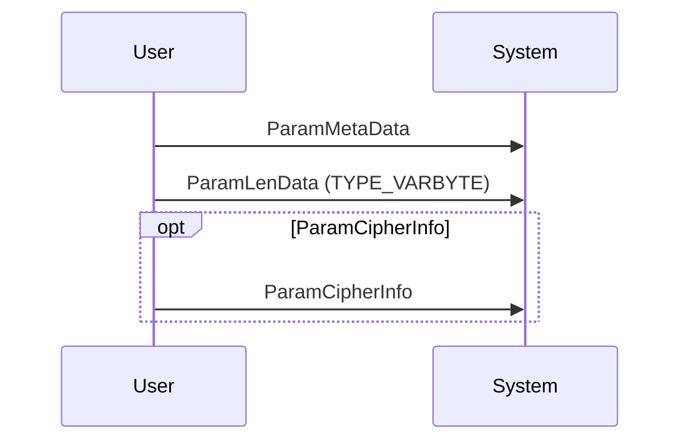
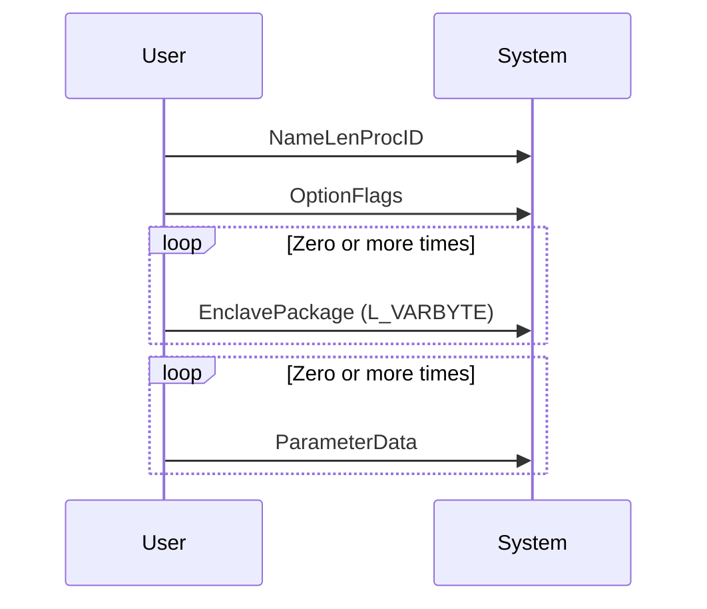
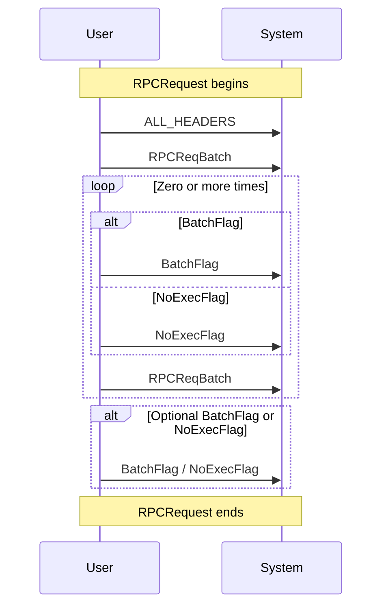

# Purpose

This page describes how to construct a RPC Request object. The page starts from the protocol grammar and then creates sequence diagrams.

The sequence diagrams and meant to be converted to code.


## RPCRequest

A batch of RPC commands can be sent in a TDS request

```ABNF
 RPCRequest       =   ALL_HEADERS 
                      RPCReqBatch 
                      *((BatchFlag / NoExecFlag) RPCReqBatch) 
                      [BatchFlag / NoExecFlag] 

```

TODO: Fill up ALL_HEADERS

## RPCReqBatch

Lets start with the grammar of Rpc request.

```ABNF

 RPCReqBatch      =   NameLenProcID 
                      OptionFlags 
                      *EnclavePackage 
                      *ParameterData 
```

### NameLenProcID description

```ABNF
NameLenProcID    =   ProcName / (ProcIDSwitch ProcID) 
```

There can be two kinds of RPC request:

1. System RPC call, where we send a Proc ID to the server, instead of the RPC name. This is what `ProcIDSwitch ProcID` means.
2. The user has provided an RPC which is a stored procedure. This is what `ProcName` means.

The implementor uses some kind of discriminator like `SqlCommand.CommandType` in ADO.Net to figure out which of the two paths to choose.

e.g. If there is a user defined stored procedure like "my_sp", then the ProcName is sent, and the `CommandType.StoredProcedure` is used to tell the driver, to use ProcName.

On the other hand, when the driver sees a default value of `CommandType.Text` then it sends a System RPC call. The default RPC proc ID is for `Sp_ExecuteSql = 10`.

```ABNF
ProcName         =   US_VARCHAR 
```

The ProcName is send as a Unicode string prefixed with the `char` length of proc followed by the Unicode Bytes of the proc.

### OptionFlags

These flags are sent

## Appendix

### Grammar

The ABNF Grammar.

```grammar
 ProcIDSwitch     =   %xFF %xFF 
 ProcName         =   US_VARCHAR 
 NameLenProcID    =   ProcName 
                      / 
                      (ProcIDSwitch ProcID) 
  
 fWithRecomp      =   BIT 
 fNoMetaData      =   BIT 
 fReuseMetaData   =   BIT 
 OptionFlags      =   fWithRecomp 
                      fNoMetaData 
                      fReuseMetaData 
                      13FRESERVEDBIT 
  
 fByRefValue      =   BIT 
 fDefaultValue    =   BIT 
 fEncrypted       =   BIT 
 StatusFlags      =   fByRefValue 
                      fDefaultValue 
                      1FRESERVEDBIT 
                      fEncrypted 
                      4FRESERVEDBIT 
  
 ParamMetaData    =   B_VARCHAR 
                      StatusFlags 
                      (TYPE_INFO / TVP_TYPE_INFO)    ; (TVP_TYPE_INFO introduced in TDS 7.3) 
 ParamLenData     =   TYPE_VARBYTE 
  
 EncryptionAlgo   =   BYTE               ; (introduced in TDS 7.4) 
  
 AlgoName         =   B_VARCHAR          ; (introduced in TDS 7.4) 
  
 EncryptionType   =   BYTE               ; (introduced in TDS 7.4) 
  
 NormVersion      =   BYTE               ; (introduced in TDS 7.4) 
  
 DatabaseId       =   ULONG              ; (introduced in TDS 7.4) 
  
 CekId            =   ULONG              ; (introduced in TDS 7.4) 
  
 CekVersion       =   ULONG              ; (introduced in TDS 7.4) 
  
 CekMDVersion     =   ULONGLONG          ; (introduced in TDS 7.4) 
  
 ParamCipherInfo  =   TYPE_INFO 
                      EncryptionAlgo 
                      [AlgoName] 
                      EncryptionType 
                      DatabaseId  
                      CekId 
                      CekVersion 
                      CekMDVersion 
                      NormVersion 
 ParameterData    =   ParamMetaData 
                      ParamLenData 
                      [ParamCipherInfo] 
  
 EnclavePackage   =   L_VARBYTE          ; (introduced in TDS 7.4) 
  
 BatchFlag        =   %x80 / %xFF        ; (changed to %xFF in TDS 7.2) 
 NoExecFlag       =   %xFE               ; (introduced in TDS 7.2) 
  
 RPCReqBatch      =   NameLenProcID 
                      OptionFlags 
                      *EnclavePackage 
                      *ParameterData 

 RPCRequest       =   ALL_HEADERS 
                      RPCReqBatch 
                      *((BatchFlag / NoExecFlag) RPCReqBatch) 
                      [BatchFlag / NoExecFlag] 
 
 RPCRequest       =   ALL_HEADERS 
                      RPCReqBatch 
                      *((BatchFlag / NoExecFlag) RPCReqBatch) 
                      [BatchFlag / NoExecFlag] 
```

## Sequence Diagrams

### NameLenProcID



### OptionFlags



### StatusFlags



### ParamMetaData



### ParamCipherInfo



### ParameterData



### RPCReqBatch




### RPCReqBatch




### RPCRequest


# The following information can be used for Data encoding

The datatypes are represented by a byte identified according to TDS protocol.

While sending the data to sql server, a Name needs to be used for each of these. Reference Microsoft.Data.SqlClient

| TdsType Value | MetaType Name String | MetaType Name       |
|---------------|----------------------|---------------------|
| `0x7F`        | "bigint"             | `BIGINT`            |
| `0x3E`        | "float"              | `FLOAT`             |
| `0x3B`        | "real"               | `REAL`              |
| `0xAD`        | "binary"             | `BINARY`            |
| `0xA5`        | "varbinary"          | `VARBINARY`         |
| `0x22`        | "image"              | `IMAGE`             |
| `0x32`        | "bit"                | `BIT`               |
| `0x30`        | "tinyint"            | `TINYINT`           |
| `0x34`        | "smallint"           | `SMALLINT`          |
| `0x38`        | "int"                | `INT`               |
| `0xAF`        | "char"               | `CHAR`              |
| `0xA7`        | "varchar"            | `VARCHAR`           |
| `0x23`        | "text"               | `TEXT`              |
| `0xEF`        | "nchar"              | `NCHAR`             |
| `0xE7`        | "nvarchar"           | `NVARCHAR`          |
| `0x63`        | "ntext"              | `NTEXT`             |
| `0x6C`        | "decimal"            | `DECIMAL`           |
| `0xF1`        | "xml"                | `XML`               |
| `0x3A`        | "datetime"           | `DATETIME`          |
| `0x3B`        | "smalldatetime"      | `SMALLDATETIME`     |
| `0x3C`        | "money"              | `MONEY`             |
| `0x7A`        | "smallmoney"         | `SMALLMONEY`        |
| `0x24`        | "uniqueidentifier"   | `ROWGUID`           |
| `0x62`        | "sql_variant"        | `VARIANT`           |
| `0xF0`        | "udt"                | `UDT`               |
| `0xF3`        | "table"              | `TABLE`             |
| `0x28`        | "date"               | `DATE`              |
| `0x29`        | "time"               | `TIME`              |
| `0x2A`        | "datetime2"          | `DATETIME2`         |
| `0x2B`        | "datetimeoffset"     | `DATETIMEOFFSET`    |
| `0xF2`        | "json"               | `JSON`              |

This table provides a detailed mapping of TDS types to their corresponding `MetaType` names and string representations.
