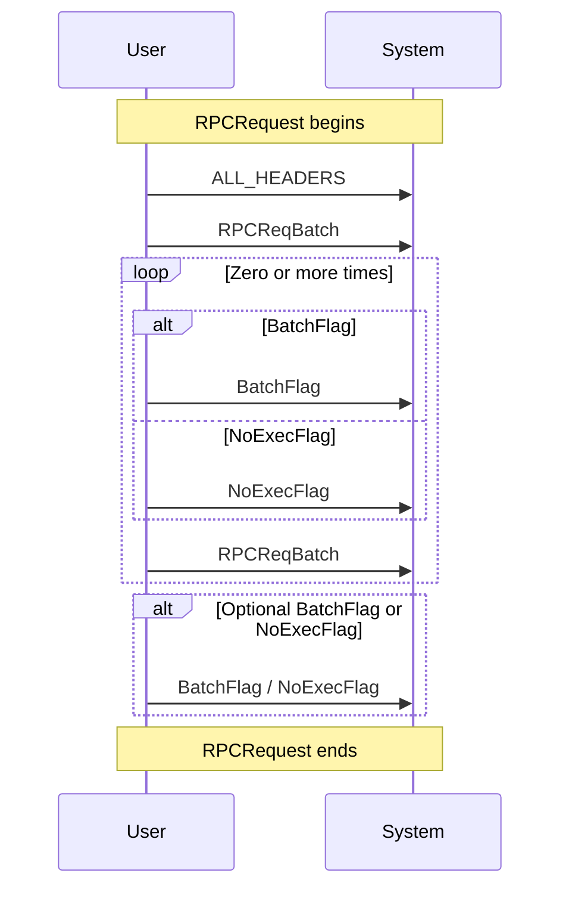
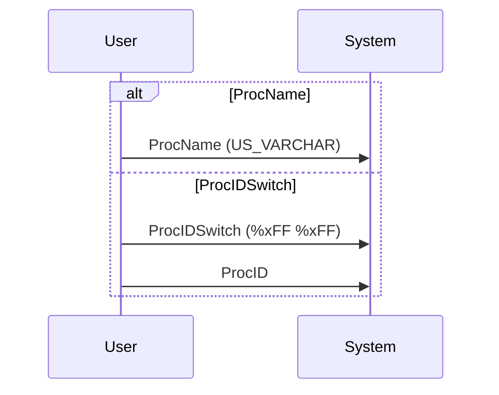
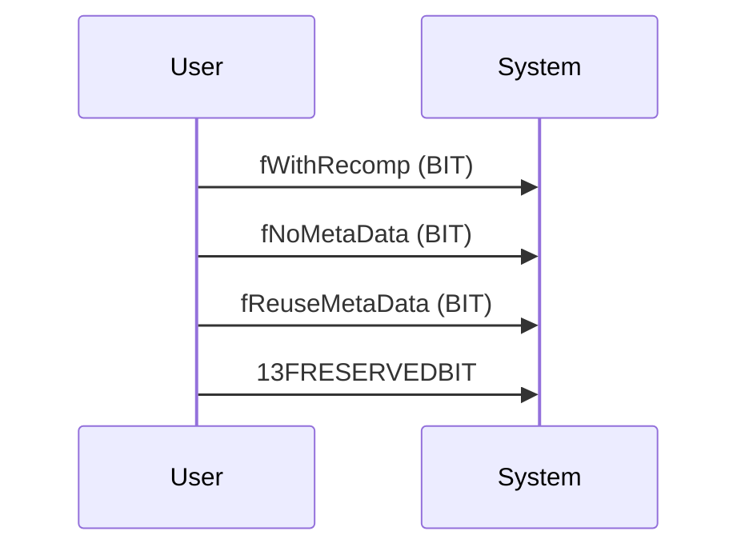
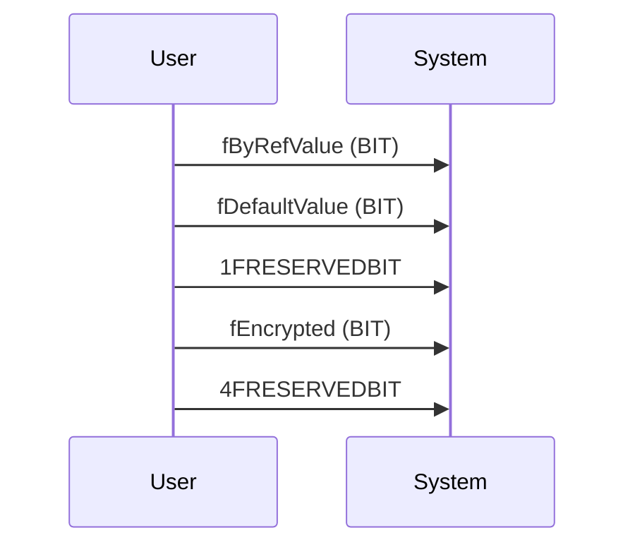
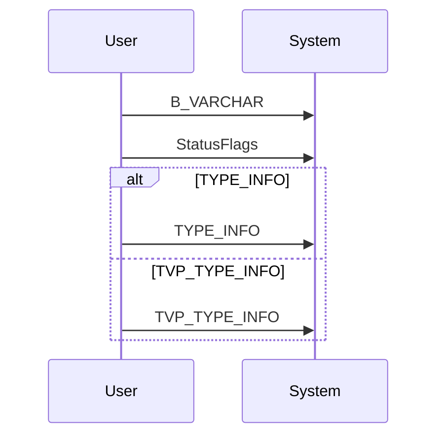
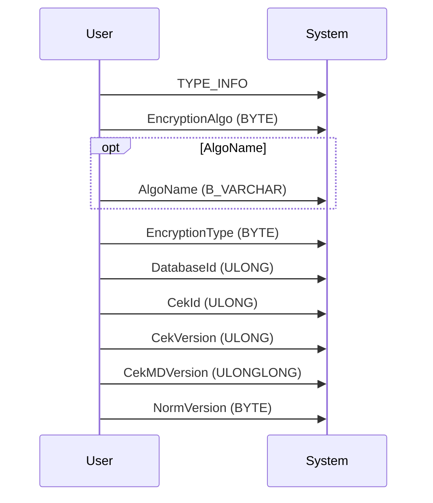
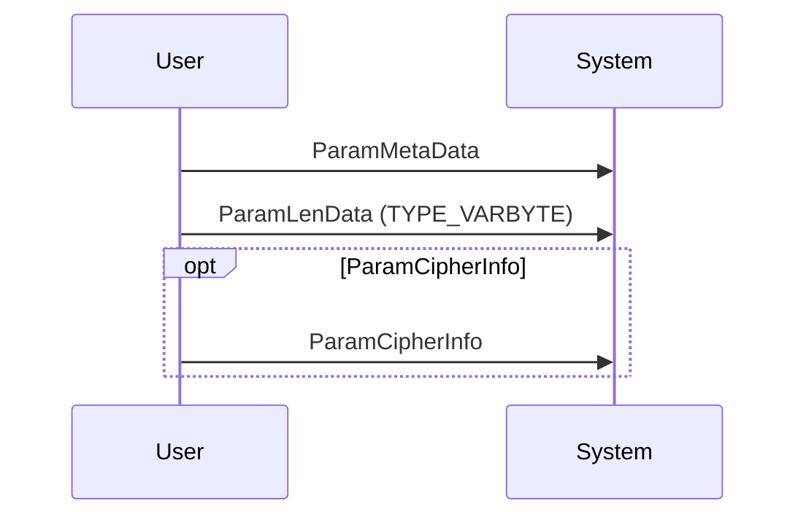
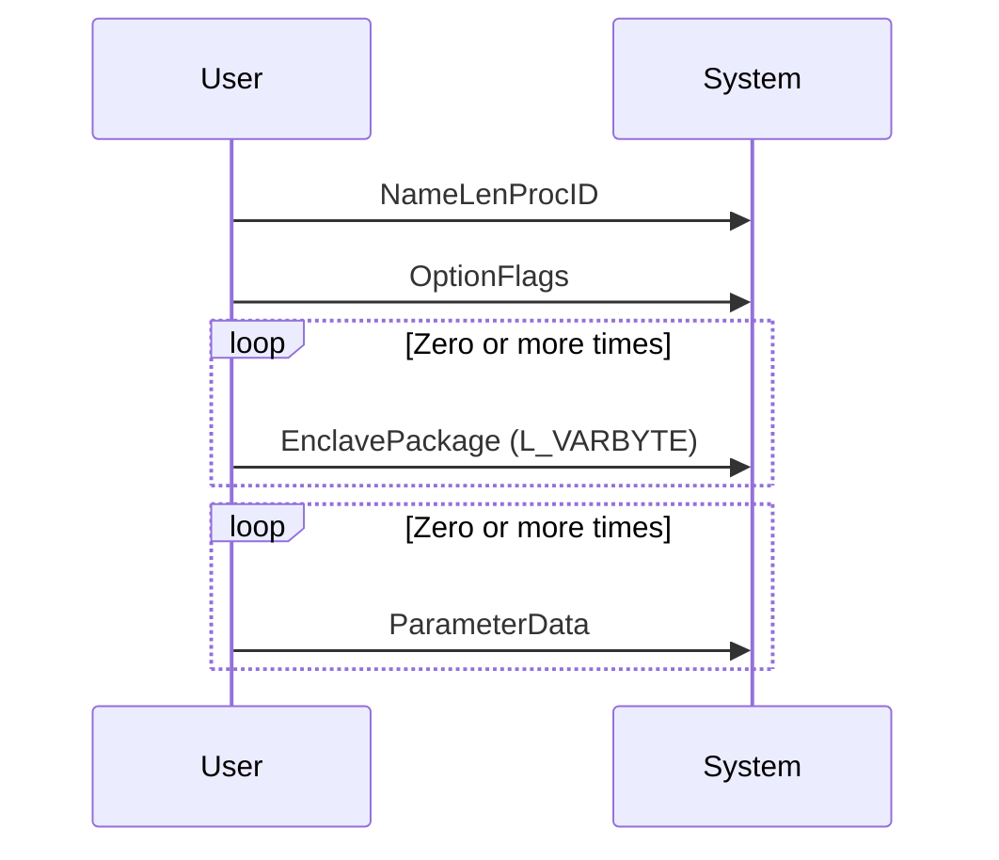

# Purpose

This page describes how to construct a RPC Request object. The page starts from the protocol grammar and then creates sequence diagrams.

The sequence diagrams and meant to be converted to code.

## Grammar

The ABNF Grammar.

```grammar
 ProcIDSwitch     =   %xFF %xFF 
 ProcName         =   US_VARCHAR 
 NameLenProcID    =   ProcName 
                      / 
                      (ProcIDSwitch ProcID) 
  
 fWithRecomp      =   BIT 
 fNoMetaData      =   BIT 
 fReuseMetaData   =   BIT 
 OptionFlags      =   fWithRecomp 
                      fNoMetaData 
                      fReuseMetaData 
                      13FRESERVEDBIT 
  
 fByRefValue      =   BIT 
 fDefaultValue    =   BIT 
 fEncrypted       =   BIT 
 StatusFlags      =   fByRefValue 
                      fDefaultValue 
                      1FRESERVEDBIT 
                      fEncrypted 
                      4FRESERVEDBIT 
  
 ParamMetaData    =   B_VARCHAR 
                      StatusFlags 
                      (TYPE_INFO / TVP_TYPE_INFO)    ; (TVP_TYPE_INFO introduced in TDS 7.3) 
 ParamLenData     =   TYPE_VARBYTE 
  
 EncryptionAlgo   =   BYTE               ; (introduced in TDS 7.4) 
  
 AlgoName         =   B_VARCHAR          ; (introduced in TDS 7.4) 
  
 EncryptionType   =   BYTE               ; (introduced in TDS 7.4) 
  
 NormVersion      =   BYTE               ; (introduced in TDS 7.4) 
  
 DatabaseId       =   ULONG              ; (introduced in TDS 7.4) 
  
 CekId            =   ULONG              ; (introduced in TDS 7.4) 
  
 CekVersion       =   ULONG              ; (introduced in TDS 7.4) 
  
 CekMDVersion     =   ULONGLONG          ; (introduced in TDS 7.4) 
  
 ParamCipherInfo  =   TYPE_INFO 
                      EncryptionAlgo 
                      [AlgoName] 
                      EncryptionType 
                      DatabaseId  
                      CekId 
                      CekVersion 
                      CekMDVersion 
                      NormVersion 
 ParameterData    =   ParamMetaData 
                      ParamLenData 
                      [ParamCipherInfo] 
  
 EnclavePackage   =   L_VARBYTE          ; (introduced in TDS 7.4) 
  
 BatchFlag        =   %x80 / %xFF        ; (changed to %xFF in TDS 7.2) 
 NoExecFlag       =   %xFE               ; (introduced in TDS 7.2) 
  
 RPCReqBatch      =   NameLenProcID 
                      OptionFlags 
                      *EnclavePackage 
                      *ParameterData 

 RPCRequest       =   ALL_HEADERS 
                      RPCReqBatch 
                      *((BatchFlag / NoExecFlag) RPCReqBatch) 
                      [BatchFlag / NoExecFlag] 
 
 RPCRequest       =   ALL_HEADERS 
                      RPCReqBatch 
                      *((BatchFlag / NoExecFlag) RPCReqBatch) 
                      [BatchFlag / NoExecFlag] 
```

## Sequence Diagrams

### RPCRequest



### RPCReqBatch


### NameLenProcID



### OptionFlags



### StatusFlags



### ParamMetaData



### ParamCipherInfo



### ParameterData



### RPCReqBatch


