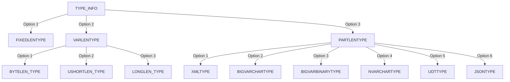

# Purpose 

Describes the grammar of the TYPE_INFO

It's scattered across the doc. This page consolidates it 

## Grammar

```ABNF
TYPE_INFO = FIXEDLENTYPE
            / (VARLENTYPE TYPE_VARLEN [COLLATION])
            / (VARLENTYPE TYPE_VARLEN [PRECISION SCALE])
            / (VARLENTYPE SCALE) ; (introduced in TDS 7.3)
            / VARLENTYPE ; (introduced in TDS 7.3)
            / (PARTLENTYPE
                  [USHORTMAXLEN]
                  [COLLATION]
                  [XML_INFO]
                  [UDT_INFO]
              )

VARLENTYPE = BYTELEN_TYPE 
             / USHORTLEN_TYPE 
             / LONGLEN_TYPE

TYPE_VARLEN = BYTELEN
              / USHORTCHARBINLEN
              / LONGLEN

LCID = 20BIT

fIgnoreCase = BIT

fIgnoreAccent = BIT

fIgnoreWidth = BIT

fIgnoreKana = BIT

fBinary = BIT

fBinary2 = BIT

fUTF8 = BIT

ColFlags = fIgnoreCase fIgnoreAccent fIgnoreKana fIgnoreWidth fBinary fBinary2 fUTF8 FRESERVEDBIT

Version = 4BIT

SortId = BYTE

COLLATION = LCID ColFlags Version SortId

USHORTCHARBINLEN = 2BYTE

BYTELEN = BYTE

USHORT = 2BYTE

LONGLEN = 4BYTE

USHORT_MAX = 2BYTE

LONG = 4BYTE

BYTELEN_TYPE = GUIDTYPE
                / INTNTYPE
                / DECIMALTYPE
                / NUMERICTYPE
                / BITNTYPE
                / DECIMALNTYPE
                / NUMERICNTYPE
                / FLTNTYPE
                / MONEYNTYPE
                / DATETIMNTYPE
                / DATENTYPE
                / TIMENTYPE
                / DATETIME2NTYPE
                / DATETIMEOFFSETNTYPE
                / CHARTYPE
                / VARCHARTYPE
                / BINARYTYPE
                / VARBINARYTYPE ; the length value associated
                ; with these data types is

USHORTLEN_TYPE = BIGVARBINARYTYPE
                / BIGVARCHARTYPE
                / BIGBINARYTYPE
                / BIGCHARTYPE
                / NVARCHARTYPE
                / NCHARTYPE ; the length value associated with
                ; these data types is specified
                ; within a USHORT

LONGLEN_TYPE = IMAGETYPE
                / NTEXTTYPE
                / SSVARIANTTYPE
                / TEXTTYPE
                / XMLTYPE

PARTLENTYPE = XMLTYPE
              / BIGVARCHARTYPE
              / BIGVARBINARYTYPE
              / NVARCHARTYPE
              / UDTTYPE
              / JSONTYPE

SCHEMA_PRESENT        = BYTE;
DbName                = B_VARCHAR
OWNING_SCHEMA         = B_VARCHAR
XML_SCHEMA_COLLECTION = US_VARCHAR
XML_INFO              = SCHEMA_PRESENT
                        [DbName OWNING_SCHEMA
                        XML_SCHEMA_COLLECTION]

FIXEDLENTYPE = INT1TYPE
                /
                BITTYPE
                /
                INT2TYPE
                /
                INT4TYPE
                /
                DATETIM4TYPE
                /
                FLT4TYPE
                /
                MONEYTYPE
                /
                DATETIMETYPE
                /
                FLT8TYPE
                /
                MONEY4TYPE
                /
                INT8TYPE
```


## Diagram



